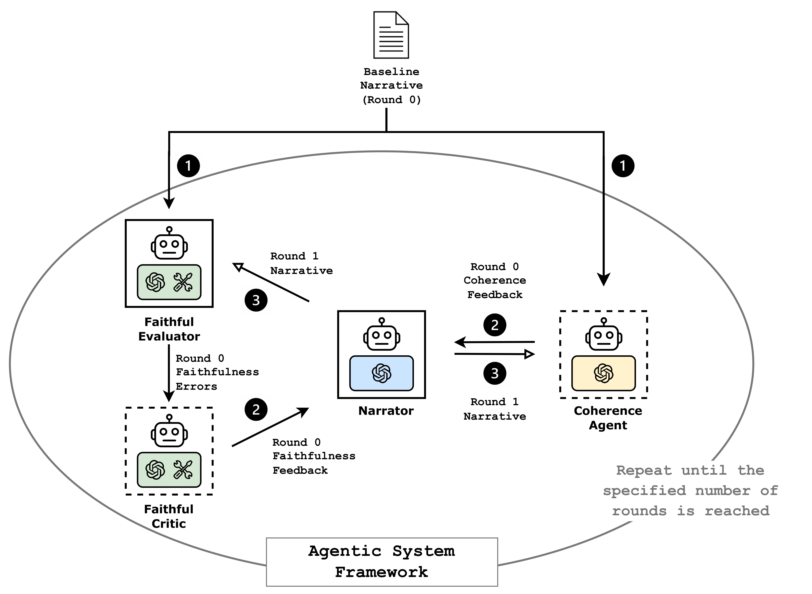

# An Agentic Approach to Generating XAI-Narratives 
**Yifan He, David Martens. University of Antwerp, Belgium**

In this repository, we propose a multi-agent framework for XAI narrative generation and refinement. 
The framework comprises the _Narrator_, which generates and revises narratives based on feedback from multiple critic agents on faithfulness and coherence metrics, thereby enabling narrative improvement through iteration.

## 1. An overview of the workflow:
<p align="center">
  
</p>

## 2. Repository Overview
| Folder                 | Description |
| -----------            | ----------- |
| data                   | Preprocessed datasets, baseline narratives, and other resources used by experiments.          |
| notebook | A four-agent-system notebook for quick test and analysis.            |
| results                 | Output directory for experiments, accuracy results, and bar chart in paper.            |
| script                 | Modules to actually run the code from shapnarrative_agents and generate the narratives and compute faithfulness.            |
| shapnarrative_agents  | Core Python package implementing the multi-agent framework, LLM wrappers, faithfulness metrics, and experiment management logic.            |


### 2.1 Set-up

1. Clone repository:

```
git clone https://github.com/ADMAntwerp/SHAPnarrative-agents/tree/clean
```

2. Create a Python virtual environment:

```
python -m venv venv
source venv/bin/activate
```

3. Install dependencies:

```
pip install -r requirements.txt
```

### 2.2 script
- **run_experiments_agentic_coherence.py**:

This script is used for running the agentic system. It includes options for warm start, feature numbers, various LLMs, number of instances, etc. The output of the experiments will be stored in a pickle format.

Run:
```
python -m script.experiments.run_experiments_agentic_coherence
```
- **compute_metrics_local_agentic.py**:

Computes faithfulness metrics on pickled experiment outputs. 

Run:
```
python -m script.experiments.compute_metrics_local_agentic
```


### 2.3 shapnarrative_agents
This package implements the core components of the multi-agent narrative generation framework:

- **`agents/`** – definitions of the different agent types used in experiments (the _Narrator_, the _Faithful Evaluator_, the _Faithful Critic_, and the _Coherence Agent_).
- **`experiment_management/`** – classes that orchestrate experiment workflows. `experiment_manager_agentic_coherence.py` manages the four-agent framework in which the agents interact with one another. This can easily be modified to suits for other agentic system designs. For example, by commenting out the initialization of the _Coherence Agent_ and related codes, this Python file then works as a three-agent framework. `experiment_dataclass_agentic_coherence.py` defines which attributes are included in the experiment's output, for example, which LLM models are used for the agent, the SHAP explanations for each instance, the narratives and feedback from each round.
- **`llm_tools/`** – LLM wrappers around various LLM APIs (OpenAI, Claude, Mistral, OpenRouter for deepseek and llama models), and the original extraction.py and generation.py that are used without an agentic approach.
- **`metrics/`** – `faithfulness_agentic.py`, functions for computing faithfulness on generated narratives.


## 3. Citation


Note. This README focuses on the script and package structure; for high‑level descriptions of the research and methodology, refer to the paper or project documentation.
